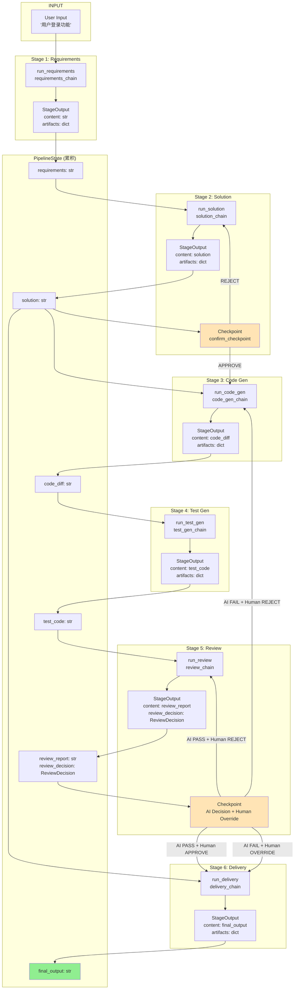

# DevFlow Engine：基于 AI 驱动的需求交付流程引擎

## directory

```
feishu_agent_project/
├── agents/                  # 6 LLM agents (wrapped LangChain RunnableSequences)
│   └── __init__.py         # Agent entry points (run_requirements, run_solution, ...)
├── chains/                  # LangChain RunnableSequence factories (one per stage)
│   ├── __init__.py
│   ├── requirements_chain.py
│   ├── solution_chain.py
│   ├── code_gen_chain.py
│   ├── test_gen_chain.py
│   ├── review_chain.py
│   └── delivery_chain.py
├── config/
│   ├── model.json           # LLM API key / base URL / model name
│   └── settings.json        # Pipeline stage toggles, output dir
├── doc/
│   └── TODO.md              # Development progress tracker
├── out/                     # Pipeline output artifacts (auto-created)
├── pipeline/                # Pipeline engine and data models
│   ├── __init__.py
│   ├── engine.py            # Stage orchestration (SequentialChain driver)
│   ├── models.py            # PipelineConfig, PipelineState, StageInput, StageOutput
│   └── config_loader.py     # JSON config loader with env var override
├── prompts/                  # LangChain PromptTemplate definitions (one per stage)
│   ├── __init__.py
│   ├── requirements.py
│   ├── solution.py
│   ├── code_gen.py
│   ├── test_gen.py
│   ├── review.py
│   └── delivery.py
├── test/
│   └── test_pipeline.py     # Models, config, agents, chains, prompts tests
├── tools/
│   ├── shell_exec.py        # Shell execution tool
│   └── web_search.py        # Web search tool
├── cli.py                   # CLI entry point
├── main.py                  # Top-level run_pipeline() wrapper
├── CLAUDE.md                # Project instructions (Chinese)
└── README.md
```


## Quick to Start

**config/model.json**

```json
{
    "API_KEY": "<your api key>",
    "BASE_URL": "<model base url>",
    "MODEL": "<model name>"
}
```

### config/ 目录说明

- `config/settings.json` — 项目配置，包含 Pipeline 各阶段开关 (`stage_enabled`) 和输出目录 (`output_dir`)
- `config/model.json` — 大模型相关配置，包含 API Key、Base URL、Model 名称


## Workflow



### PipelineState 字段生命周期

| 字段 | 生命周期 | 说明 |
|------|---------|------|
| `original_input` | 始终 | 用户原始需求 |
| `requirements` | S1→S2→... | 需求分析输出 |
| `solution` | S2→S3→... | 方案设计输出 |
| `code_diff` | S3→S4→S5→... | 代码 diff |
| `test_code` | S4→S5→... | 测试代码 |
| `review_report` | S5→S6 | 审查报告 |
| `review_decision` | S5→CP2 | AI 判断 + 人类Override |
| `final_output` | S6结束 | 最终交付物 |

### Review Checkpoint 状态机

| AI 判断 | 人类操作 | 路由 |
|---------|---------|------|
| PASS | APPROVE | → delivery |
| FAIL | OVERRIDE | → delivery (allow_human_override=true) |
| PASS | REJECT | → 重新 review |
| FAIL | REJECT | → code_gen |

